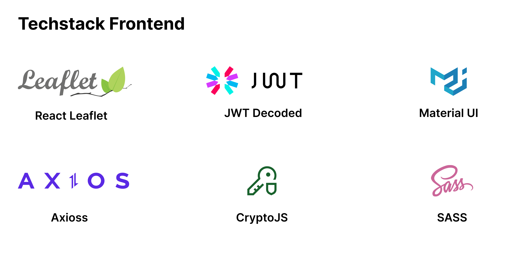
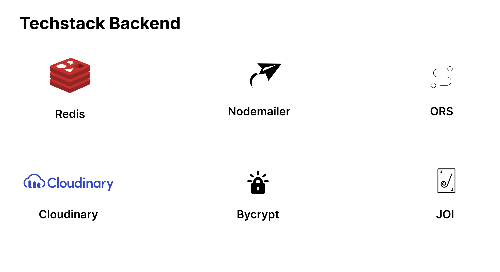

## Codepresso

Codepresso is a full-fledged online platform revolutionizing your coffee experience. Seamlessly combining the love for coffee with the ease of online convenience, Codepresso offers a one-stop solution for Coffee Selection, Secure Payments and Ordering.

> **Note**
>
> This project is no longer being worked on. This branch repo only serves to give inspiration to others as a point in time reference.


## Run Project

### Server

1. Run the redis-server

2. Run the backend
   ```
   npm run dev
   ```

### Client

```
npm start
```

## Stack

Summary of what the stack looks like now including a picture with the core tech:

- **Front-end** - React.js (vite) as the core framework, Material UI and sass for UI,Midtrans Payment and React Leaflet for map.
- **Data** - All data is modeled and stored in MysqlDB.
- **API** - implement restfull api, for frontend and backend communication
- **Auth** - Uses a JsonWebToken(JWT) that is used to store user information, and is used to determine user authority.




### Back-end

See more information about backend in [here](/server/README.md)

### Front-end

See more information about our [Front-end, components, routing and convention](/client/README.md)
